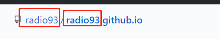

##### 快捷键

```bash
Ctrl+B对选中字体加粗
$$+Enter 公式
```

##### [Hexo](https://hexo.io/zh-cn/docs/)

```bash
$ hexo new 新博客名字
#编译md文件为静态页面
$ hexo generate
#推送public文件夹到main，github收到main发生变化，会自动重启，需要等待一会
$ hexo deploy

$ hexo new page "页面名称"
```

source源码维护，方便不同计算机维护博客

```bash
更新本地源码到source
git init
git checkout -b source
git add -A
git commit -m "init blog"
git remote add origin git@github.com:radio93/radio93.github.io.git
git push origin source
```


##### 新环境博客维护

```bash
#从git上的source分支down下来的源码
$ cd 项目
#Hexo 3.0 把服务器独立成了个别模块，必须先安装 hexo-server 才能使用
$ npm install hexo-server --save
#编译博客源码为静态页面
$ hexo generate
#尝试启动博客 默认端口4000
$ hexo server
如果端口冲突 可以修改端口
$ hexo server -p 5000

```

##### 常见问题

###### 	如果radio93.github.io无法访问，需要修改此处，博客主页在main下的index.html


###### 	项目名称需要和github名称保持一致




